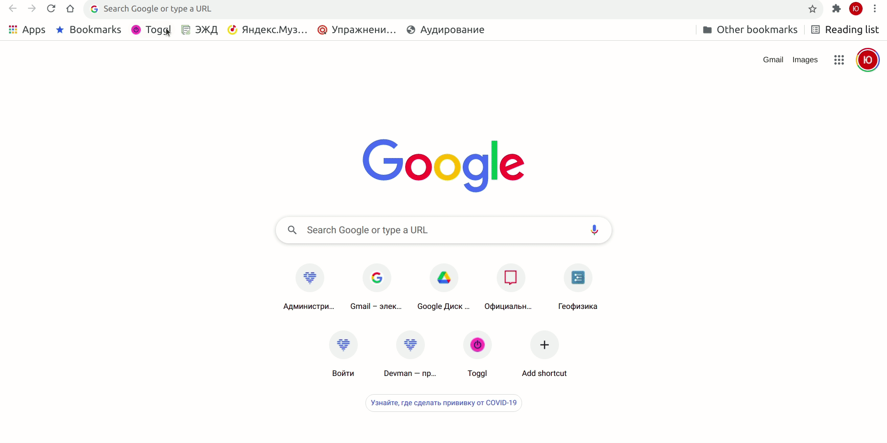

# Онлайн-библиотека научной фантастики

Онлайн-библиотека книг жанра "Научная фантастика". Книги скачаны с сайта [tululu.org](https://tululu.org/l55/) с помощью [парсера](https://github.com/Yulia51188/book_parser). Сайт доступен по [ссылке](https://yulia51188.github.io/book-site/pages/index1.html). Технически сайт сверстан с помощью [BootStrap](https://bootstrap-5.ru/), рендеринг шаблонов реализован с помощью [Jinja2](https://pypi.org/project/Jinja2/).




## Как читать книги онлайн

Просто перейдите по [ссылке](https://yulia51188.github.io/book-site/pages/index1.html) и читайте книги в вашем браузере.

## Как пользоваться библотекой оффлайн

Если планируете пользоваться сайтом без подключения к интернету, то необходимо: 
- Скачать файлы данного репозитория
- Найти в папке `pages` файл `index1.html` и открыть двойным щелчком
- Выбирайте книги и читайте в окне браузера оффлайн

## Как развернуть сайт для разработки

- Для работы со скриптом необходим [Python](https://www.python.org/downloads/) версии 3.7+ и менеджер пакетов `pip`.

- Установите зависимости в виртуальном окружении проекта:
```bash
$ pip install -r requirements.txt
```

- Запустите сайт с помощью
```bash
$ python render_website.py 
[I 211117 14:38:25 server:335] Serving on http://127.0.0.1:5500
[I 211117 14:38:25 handlers:62] Start watching changes
[I 211117 14:38:25 handlers:64] Start detecting changes

```
Функции библиотеки livereload позволяют автоматически отслеживать изменения в шаблоне и перезагружать страницы сайта

- Перейдите на сайт по адресу [http://127.0.0.1:5500/pages/index1.html](http://127.0.0.1:5500/pages/index1.html)

## Цель проекта

Код написан в образовательных целях на онлайн-курсе для веб-разработчиков dvmn.org.

